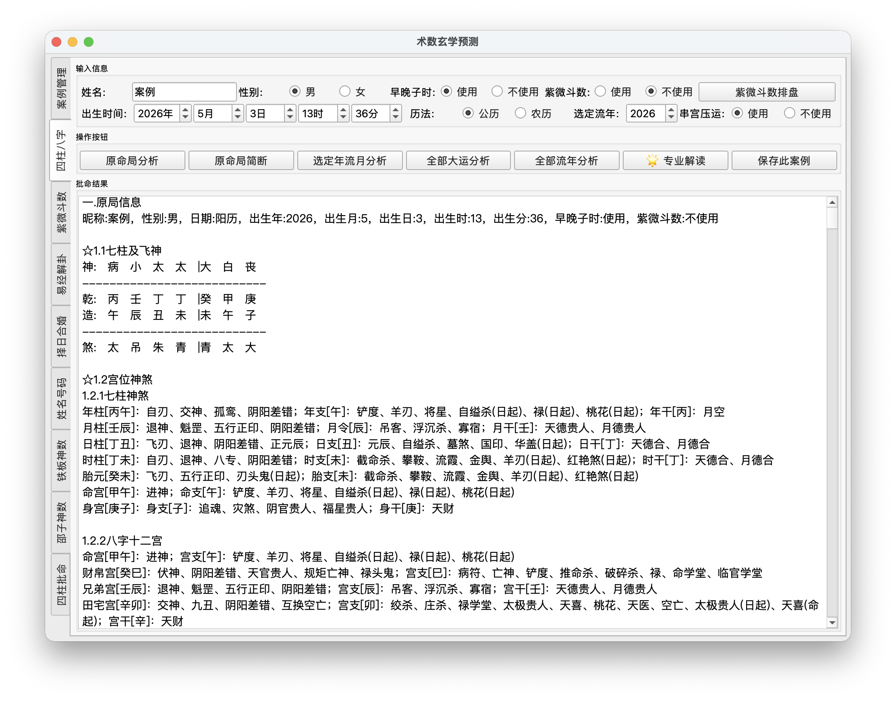
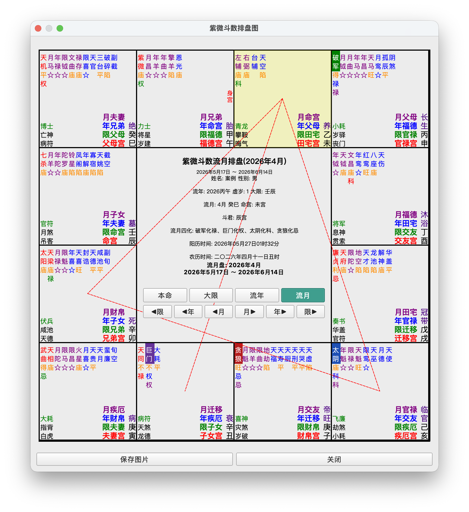
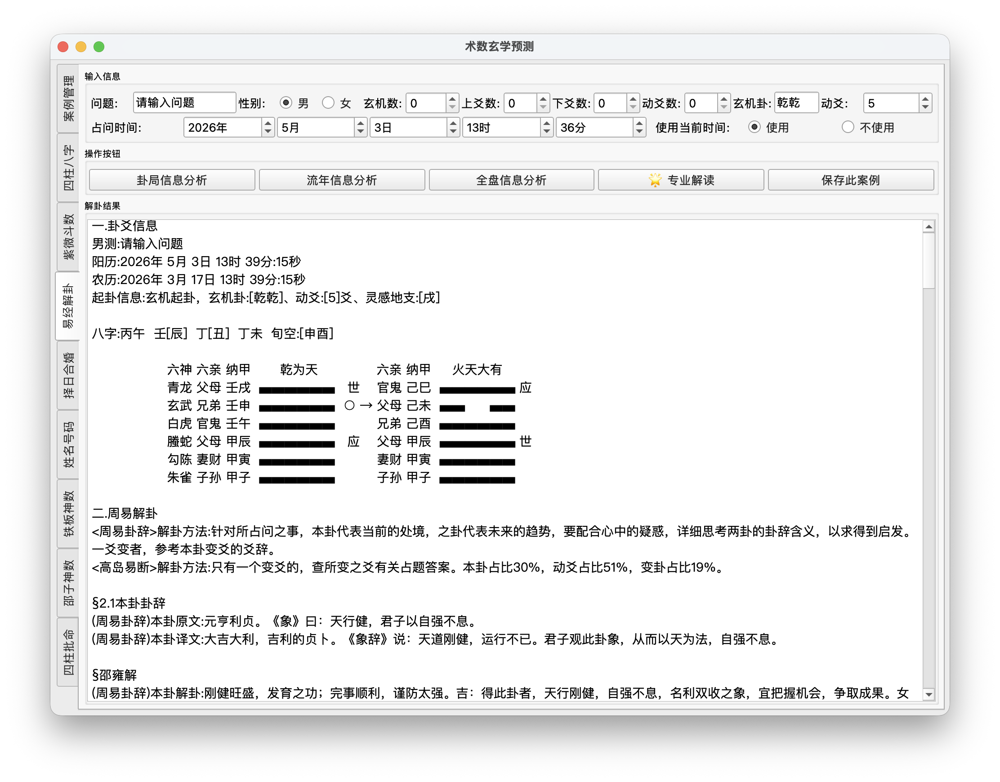
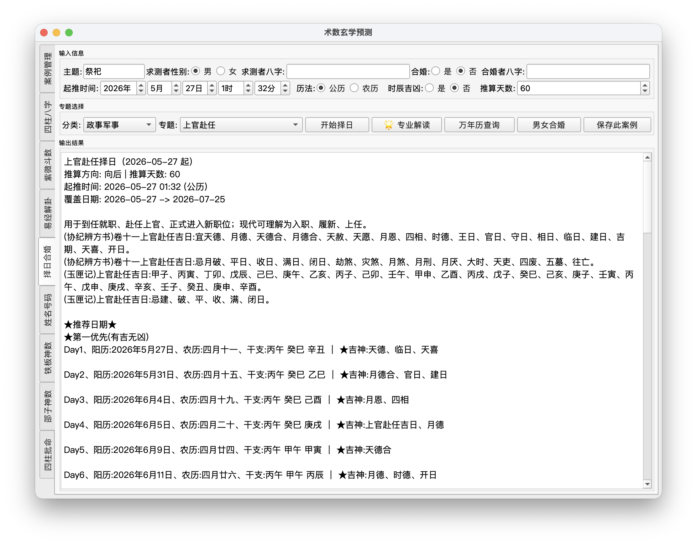
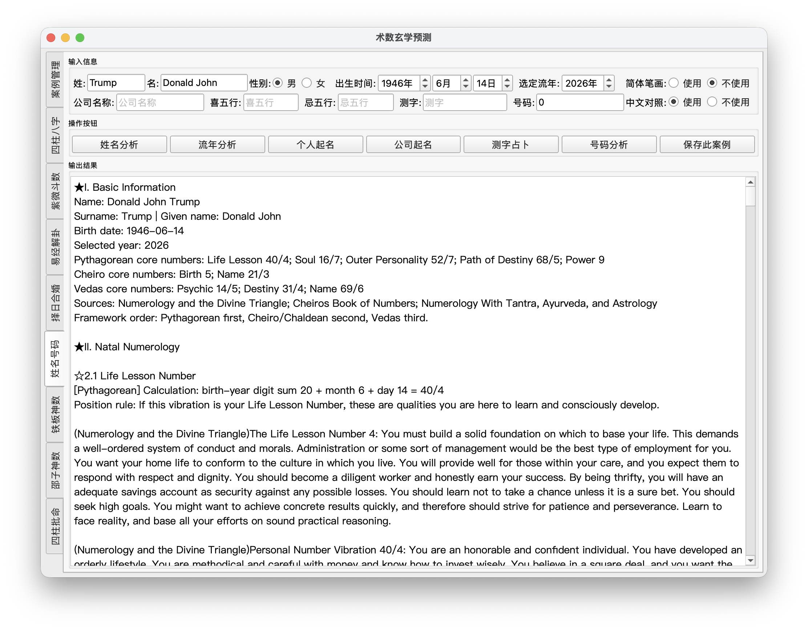
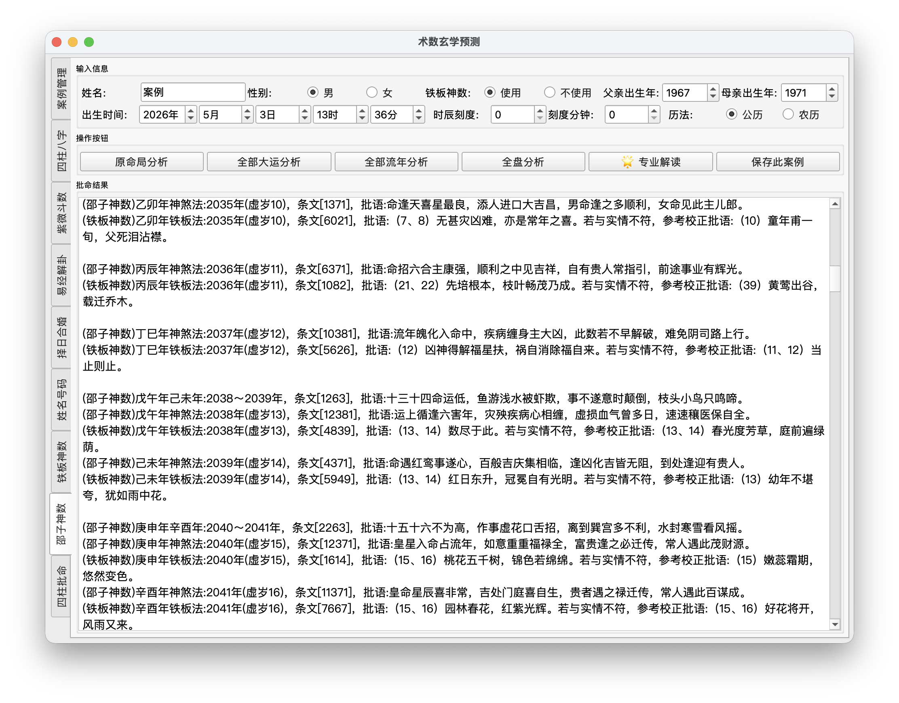
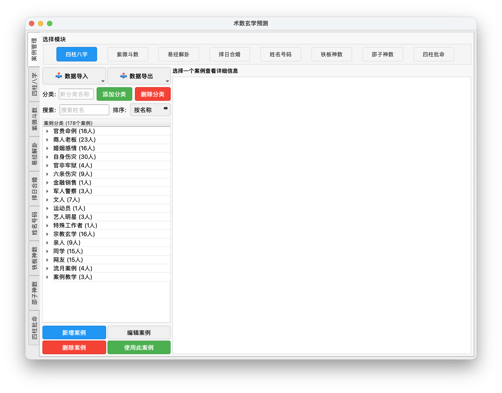

<h1 align="center">MetaphysicsQuant</h1>
<p align="center"><strong>工程化中国术数分析平台 · Traditional Chinese Metaphysics, Built as Software</strong></p>

<p align="center">
  <a href="README.md">Main</a> |
  <a href="README/README_CN.md">简体中文</a> |
  <a href="README/README_EN.md">English</a>
</p>

<p align="center">
  <a href="https://img.shields.io/github/stars/lyzhk/MetaphysicsQuant?style=for-the-badge"></a>
  <a href="https://img.shields.io/github/forks/lyzhk/MetaphysicsQuant?style=for-the-badge"></a>
  <a href="https://img.shields.io/badge/Python-3.10%2B-3776AB?style=for-the-badge&logo=python&logoColor=white"></a>
</p>

> **Showcase Notice**
>
> 这是一个**公开展示仓库**，只用于介绍项目设计、功能范围、工程难点和界面成果。
> 不包含源码、规则数据、案例数据库、API 配置或任何可直接复现商业化能力的私有资产。

## 项目简介

MetaphysicsQuant 是一个把中国传统术数做成软件系统的长期工程项目。

它不是简单的“排盘工具”或“玄学脚本合集”，而是把传统命理、历法、卦象、择日、姓名学、数理系统中大量分散在古籍、口诀、经验规则里的知识，拆成了：

- 可执行的规则引擎
- 可维护的数据结构与 JSON 条文库
- 可复用的历法底层
- 可保存、检索、导出、回填的案例系统
- 可接入大模型的专题分析工作流
- 多模块统一的桌面端产品体验

如果用一句话概括，这个项目的核心价值是：

> **把传统术数中最难工程化的知识，做成一个可运行、可追溯、可扩展、可长期使用的软件平台。**

## 为什么这个项目难

这个项目的难点不在 UI，而在“知识系统的软件化”。

传统术数类系统常见的问题是：

- 规则散落在古籍、表格、口诀和人工经验里，缺少统一表达
- 不同系统对时间、历法、流派口径高度敏感，容错空间很小
- 输出往往不是固定字段，而是长篇结构化文本、专题断语和上下文组合
- 同一用户会反复分析、比较、修订，需要案例留存与回填
- 如果叠加 AI，必须先有可靠的规则层，不能让模型凭空“发挥”

MetaphysicsQuant 处理的是这些真正复杂的部分：

- 先做规则系统，再做交互层
- 先做结构化输出，再做 AI 解读
- 先做可复查的报告链路，再做结果展示

## 项目规模快照

以下是**私有源码主仓库**当前的规模快照（公开展示仓库不包含这些实现文件）：

| 指标 | 规模 |
|---|---:|
| Python 文件数 | 181 |
| Python 代码行数 | 91,824 |
| JSON 文件数 | 448 |
| 四柱八字模块 | 12 个 Python 文件，16 个 JSON 文件 |
| 紫微斗数模块 | 15 个 Python 文件，20 个 JSON 文件 |
| 姓名学模块 | 11 个 Python 文件，391 个 JSON 文件 |
| 历法底层 | 42 个 Python 文件 |
| AI 分析层 | 38 个 Python 文件 |

这说明它不是一个“单文件 demo”，而是一个有明显分层、规则沉淀和长期演化痕迹的完整软件工程。

## 功能总览

| 模块 | 功能范围 |
|---|---|
| 四柱八字 | 数字排盘、干支手输、原局、大运、流年、流月、胎元、命宫、身宫、七柱分析、紫微联动 |
| 紫微斗数 | 十二宫排盘、主辅杂曜、四化、星曜亮度、大限、流年、流月、排盘图、组合断语 |
| 易经解卦 / 六爻 | 时间起卦、三数起卦、玄机数、玄卦输入、本卦变卦、六亲、六神、世应、纳甲、流年解卦 |
| 择日合婚 | 万年历、阴历年历、70+ 专题择日、婚嫁纳采、政事军事、营造动土、出行求财、求医入宅、安葬启攒、合婚分析 |
| 姓名号码 | 中文姓名学、五格三才、八十一数理、个人起名、公司起名、测字、号码分析 |
| 西文数理 | Pythagorean、Cheiro/Chaldean、Vedas 三体系合并报告 |
| 铁板神数 / 邵子神数 | 生辰转数、刻分、条文检索、原局、大运、流年、综合报告 |
| 案例系统 | SQLite 案例库、分类、检索、备注、导入导出、报告导出、回填分析界面 |
| AI 专题分析 | 报告拆分、专题提示词、供应商抽象、模型调用、结果解释与现实建议 |

## 重点模块拆解

### 1. 四柱八字：规则密度最高的核心模块

四柱八字模块是整个系统里最重的一块，不只是“排出四柱”，而是把排盘后的规则判断、专题拆分和报告生成全部程序化。

它覆盖的能力包括：

- 公历/农历出生时间转四柱
- 年柱、月柱、日柱、时柱手动输入
- 原局、大运、流年、流月多层分析
- 胎元、命宫、身宫与七柱扩展视角
- 与紫微斗数排盘图联动

更重要的是底层规则量非常大。项目中四柱底层规则类包含数百个方法，其中大量直接用于：

- 神煞识别
- 格局判断
- 刑冲合会关系处理
- 串宫压运
- 民间断法与古籍条文映射

这部分最能体现项目的工程含量，因为这里处理的不是 CRUD，而是**高度知识密集的规则系统建模**。

四柱模块的 `data/` 目录还沉淀了大量典籍与规则数据，例如：

- `SanMingTongHui.json`：《三命通会》
- `DiTianSui.json`：《滴天髓》
- `QiongTongBaoJian.json`：《穷通宝鉴》
- `ShenFengTongKao.json`：《神峰通考》
- `WuXingJingJi.json`：《五行精纪》
- `GuiGuZi_LTQ.json`、`GuiGuZi_MGB.json`：鬼谷子分定经、鬼谷子命宫表
- `YuanTiangangCG.json`：袁天罡称骨
- `SanShiYanQin.json`：三世演禽
- `SuShiMangPai.json`：苏氏盲派
- `DaMoYiZhangJing.json`、`JueFa.json`、`Books.json` 等补充数据

代码层还直接引用《渊海子平》《兰台妙选》《玉照神应真经》《永乐大典》《天元巫咸经》等来源或规则名。对外展示时，最准确的说法不是“做了一个八字工具”，而是：

> **把多种古籍、口诀、盲派经验和程序规则合并成可执行的专题报告系统。**

这部分也不是停留在概念层。四柱封装层 `SZBZ_6BzMs.py` 已经支持：

- 原局命书：`bzms_num()` / `bzms_gz()`
- 简断命书：`bzmss_num()`
- 大运命书：`dyms_num()` / `dyms_gz()`
- 流年命书：`lnms_num()` / `lnms_gz()`
- 流月命书：`lyms_num()` / `lyms_gz()`
- 从当前年份起的 10 年流年中批：`zpln_num()`
- 流年与大运交接分段、流月与大运交接分段
- 可选紫微斗数联动，生成原局、大限、流年排盘图并保存图片

仓库里还能看到真实的脱敏长报告样本，而不是只有界面：

- `character_case/CaseReports/XXX/XXX_四柱八字_原局分析_20260421_043836.md`：约 `36,035` 字符
- `character_case/CaseReports/A参考模板/XXX_四柱八字_原局分析_20260421_031317.txt`：约 `30,142` 字符

这说明系统实际能输出长篇结构化命理报告，而不是只有“排盘 + 一段短评”。

### 2. 紫微斗数：可视化排盘 + 数据驱动断语

紫微斗数模块除了排盘本身，更强调“可维护的断语系统”和“图形化命盘表达”。

它的特点包括：

- 十二宫命盘生成
- 主星、辅星、杂曜与四化安置
- 星曜亮度状态
- 大限、流年、流月多层盘面
- 原局 / 大限 / 流年 / 流月四层排盘图
- 组合星曜与男女差异化断语匹配

这一模块的工程价值在于：

- 把断语维护从硬编码 `if-else`，迁移到 JSON 驱动的数据层
- 把复杂盘面做成可切换、可导出、可展示的桌面图形组件
- 把“数据组织”和“命盘显示”拆分成独立演进的能力层

### 3. 易经解卦 / 六爻：规则输出与资料体系并存

易经解卦模块既有起卦与解卦逻辑，也有配套资料资产。

它支持：

- 时间起卦
- 三数起卦
- 玄机数与玄卦输入
- 本卦、变卦、动爻、六亲、六神、世应、纳甲
- 流年解卦
- 小六壬、诸葛神数、干支神数、太极神数、牙牌神数等辅助系统

这个模块的特点是**分析逻辑**和**卦辞资料体系**同时存在，既能输出程序计算结果，也能组织配套的说明性内容。

### 4. 择日合婚：按专题建模，而不是黄历平铺

择日模块不是普通黄历查询，而是把《协纪辨方书》《玉匣记》等来源里的择日条文，重组为**可筛选、可分类、可批量输出**的专题系统。

当前实现不是少数几个按钮，而是按“用事大类 -> 专题 -> 神煞规则 -> 单日吉凶信号 -> 日期范围输出”组织。界面层可以按分类直接切换专题，底层则由：

- `ZR_2Rules.py`：维护专题分组、原文附录、专题说明与规则数据
- `ZR_3Ms.py`：维护专题 good/bad 神煞信号、规则 dispatch、单日判断和区间输出
- `ZR_Widget.py`：桌面端分类选择、日期范围推算、合婚参数输入

目前已整理为 4 大类、70+ 个专题，覆盖范围远超“婚嫁/搬家/开业”这类常见黄历标签。

可直接展示的专题范围包括：

- 政事军事：祭祀、祈福、求嗣、上册进表章、颁诏、覃恩肆赦、施恩封拜、诏命公卿招贤、举正直、宣政事、布政事、庆赐赏贺、宴会、入学、应试赴举、学技艺、拜师、冠带、行幸遣使、安抚边境、选将训兵、出师、上官赴任、临政亲民
- 生活用事：结婚姻、纳采问名、嫁娶、进人口、搬移、入宅移居、远回、安床、解除、沐浴、整容剃头、整手足甲、求医疗病、疗目、针刺、裁制
- 营造动土：营建宫室、修宫室、缮城郭、筑堤防、兴造动土、竖柱上梁、修仓库、鼓铸、苫盖、经络、酝酿、开市、立券交易、提车、纳财、开仓库出货财、出行、出行求财、出财放债、纳财收债、分家产、买田地房产、修置产室、开渠穿井、安碓磑、补垣塞穴、扫舍宇、修饰垣墙、平治道涂、破屋坏垣
- 农畜丧事：伐木、捕捉、畋猎、取鱼、乘船渡水、栽种、牧养、纳畜、破土、安葬、启攒

除了专题数量本身，真正有工程含量的是它的规则组织方式：

- 专题不是死文本，而是映射到 good / bad 神煞列表
- 单日判断不是固定模板，而是 dispatch + fallback 规则综合匹配
- 系统会自动叠加通用凶神，如十恶大败日、杨公忌日、月忌日
- 传入求测者八字后，还会叠加个人化凶神，如冲福主年命、冲福主日命、箭刃煞、回头贡煞、天罡四煞
- 同时支持万年历、阴历全年年历、单专题择日、合婚参考分析

这部分很适合对外强调：它不是把黄历平铺到界面上，而是把传统择日知识拆成了**专题化规则系统**。

### 5. 姓名学与西文数理：高数据密度模块

姓名模块看似轻，实际上数据最重。

它覆盖：

- 中文姓名学
- 康熙 / 新华笔画
- 五格三才
- 八十一数理
- 个人起名与公司起名
- 测字
- 号码分析
- 英文 numerology 三体系整合

尤其是个人起名功能，不只是随机拼字，而是引入了：

- 诗经、楚辞、论语、周易、唐诗、宋词、宋诗等语料
- 字义评分
- 笔画筛选
- 三才五格校验
- 读音与字形规则
- 候选池排序与随机展示

这一块很适合用于展示“数据工程 + 规则设计 + 产品体验”的组合能力。

### 6. 铁板神数与邵子神数：传统数理系统的软件表达

这一组模块的特点是：

- 输入与规则高度依赖生辰、刻分、干支与条文体系
- 输出不是单一数值，而是命盘、条文、原局 / 大运 / 流年多层文本
- 同时包含卦象映射和传统数理检索逻辑

它们体现了项目在“多体系并存”的情况下仍保持统一产品结构的能力。

## 各术数模块的方法级输出接口与报告形态

上面那一节更偏“项目介绍”。如果从工程展示和简历项目说明的角度看，外部读者通常还会关心一个更实际的问题：

> **这些术数模块到底能输出什么？是概念上的支持，还是已经做成了方法级接口、界面动作和可导出的真实报告？**

下面这一节专门回答这个问题，而且尽量按“封装类 / 实际输出方法 / 桌面端动作 / 可见产物 / 当前实现状态”展开。

### 四柱八字：方法级接口最完整的主干模块

四柱模块当前的封装核心是 `four_pillars_destiny/SZBZ_6BzMs.py`。这一层不是单一排盘函数，而是一套围绕“原局 - 大运 - 流年 - 流月 - 中批 - 联动排盘图”组织的输出接口。

#### 1. 主要文本输出接口

- 原局命书：`bzms_num()` / `bzms_gz()`
- 简断命书：`bzmss_num()`
- 大运命书：`dyms_num()` / `dyms_gz()`
- 流年命书：`lnms_num()` / `lnms_gz()`
- 流月命书：`lyms_num()` / `lyms_gz()`
- 从当前年份起的 10 年流年中批：`zpln_num()`
- 流年与大运交接分段：`get_ln2dy()`、`get_ln_num2dygz()`、`get_lnnum_dayun_gz_list()`
- 流月与大运交接分段：`get_month_dayun_gz()`
- 反查出生时间：`get_birth_date()`

这里的 `num` 和 `gz` 两套入口，分别对应：

- `num`：按公历/农历年月日时分输入，适合真实出生资料
- `gz`：按年柱、月柱、日柱、时柱手输，适合古籍案例、课堂推演、已知八字反查

#### 2. 桌面端动作与按钮语义

`SZBZ_Widget_Num.py` 当前直接对应以下桌面动作：

- `bzms_analysis()`：原局分析
- `bzmss_analysis()`：原局简断
- `dyms_analysis()`：大运分析
- `lnms_analysis()`：流年分析
- `lyms_analysis()`：流月分析
- `popup_result()`：把结果放入统一结果弹窗
- `show_chart_from_bazi()`：从八字出生数据直接联动紫微斗数排盘图

`SZBZ_Widget_Gz.py` 则面向“四柱批命”场景，对应干支手输模式：

- `bzms_analysis()`：原局分析
- `dyms_analysis()`：大运分析
- `lnms_analysis()`：流年分析
- `lyms_analysis()`：流月分析

也就是说，四柱模块不是“一个按钮出所有结果”，而是按命理师实际工作流拆成多种分析层级。

#### 3. 真实产物与可验证样本

仓库当前可见的脱敏样本说明，这些接口已经落到真实产物，而不是停留在设计目标：

- `character_case/CaseReports/XXX/XXX_四柱八字_原局分析_20260421_043836.md`
  当前文件约 `36,035` 字符
- `character_case/CaseReports/A参考模板/XXX_四柱八字_原局分析_20260421_031317.txt`
  当前文件约 `30,142` 字符
- `character_case/CaseReports/XXX/XXX_四柱八字_流年分析_20260421_043844.md`
- `character_case/CaseReports/XXX/XXX_四柱八字_综合分析_20260516_211833.md`
- `character_case/CaseReports/安培晋三/安培晋三_四柱八字_原局分析_20260408_154859.md`
- `character_case/CaseReports/清孝钦太后/清孝钦太后_四柱八字_原局分析_20260423_122021.md`

这类样本的意义不只是“有导出文件”，而是说明系统能稳定输出长文本、专题化、可归档、可复查的结构化结果。

#### 4. 工程展示时建议强调的点

- 这是一个已经形成“多层级报告树”的术数模块
- 不是只算八字，而是把原局、大运、流年、流月、交接段、中批和图形联动都做了
- 具备“文字报告 + 图形排盘 + 案例归档 + AI 二次解读”的完整链路

### 紫微斗数：文本命书、十二宫信息与统一排盘图

紫微斗数模块的封装核心是 `purple_star_astrology/ZWDS_6ZwMs.py`。它目前已经形成了“原局专题 + 十二宫总览 + 流年专题 + 图形化排盘图”的组合输出。

#### 1. 主要文本输出接口

- 原局专题命书：`zwms_num()`
- 原局十二宫信息：`zwg12ms_num()`
- 流年专题命书：`zwlnms_num()`
- 大限命书接口预留：`zwdxms_num()`

需要实话实说的一点是：

- `zwdxms_num()` 这个接口已经留在封装层里
- 但当前桌面端的“全部大限分析”仍显示“功能暂未实现”
- “全部流年分析”按钮在 widget 层也还是占位说明

这反而是对外展示时一个很真实的工程信号：项目并不是靠文案把所有能力都说满，而是哪些已经落地、哪些还在演进，会如实区分。

#### 2. 图形输出接口

紫微斗数模块的一个关键展示点，不只是文本，而是统一排盘图：

- 统一排盘图入口：`show_zwds_chart()`
- 对话框类：`ZwdsUnifiedChartDialog`
- 四层切换：原局 / 大限 / 流年 / 流月
- 支持图片保存：PNG / JPG
- 悬浮中心控件：年份、月份、大限切换
- 也可被四柱模块复用，从八字出生数据直接联动打开紫微排盘图

这说明紫微不是“后台算完一堆字”，而是已经形成图形化产品形态。

#### 3. 桌面端动作与按钮语义

`ZWDS_Widget.py` 当前直接对应：

- `analysis()`：原局分析，对应 `zwms_num()`
- `g12_analysis()`：十二宫分析，对应 `zwg12ms_num()`
- `lnpd_analysis()`：流年批导分析，对应 `zwlnms_num()`
- `show_unified_chart()`：打开统一排盘图
- `popup_result()`：统一结果弹窗

此外还有两个暂未完成的占位动作：

- `dxfx_analysis()`：全部大限分析，当前未完成
- `lnms_analysis()`：全部流年分析，当前未完成

#### 4. 数据层与断语层

紫微斗数模块之所以值得展示，不只是因为“能画盘”，而是因为它把断语做成了数据驱动：

- 主星 / 辅星 / 四化基础数据：`star_zx.json`、`star_fx.json`、`star_4h.json`
- 宫位和专题断语：`topic_*.json`
- 四化飞星断语：`topic_4h.json`
- 组合星匹配引擎：`StarCombinationMatcher`

可以对外明确说：

> **紫微斗数模块已经不是纯 if-else 规则堆砌，而是把星曜资料、专题断语和图形排盘分成了可维护的多层结构。**

#### 5. 当前可见产物状态

与四柱不同，当前 `character_case/CaseReports/` 里我这轮检索没有看到公开保留的紫微斗数脱敏样本报告文件。

这意味着：

- 紫微的文本命书接口和排盘图功能是存在的
- 但公开展示仓库更适合强调其“方法级接口 + 图形输出 + 数据层设计”
- 不宜像四柱那样强行宣称“已有同量级公开脱敏长报告样本”

这种区分对外反而更专业。

### 易经解卦 / 六爻：一卦多断、多路神数并联的分析模块

六爻模块的封装核心是 `hexagram_divination/LY_2Ms.py`。它的特点不是单一“解一卦”，而是把多种解读路径并联起来，形成一个多角度分析总报告。

#### 1. 主要文本输出接口

- 原局分析：`lypd_ly()`
- 流年分析：`lypd_ln()`
- 全盘综合分析：`lypd_all()`

这三类是桌面端最直接的输出接口。

#### 2. 辅助解卦接口

除了主报告外，这个模块内部还整合了多条辅助分析路径：

- 周易卦辞总解：`zypd_all()`
- 小六壬：`xlrpd_all()`
- 黄石公望空四字数：`szsspd_all()`
- 干支神数：`gzsspd_all()`
- 诸葛神数：`zgsspd_all()`
- 太极神数：`tjsspd_all()`
- 牙牌神数：`ypsspd_all()`
- 神数汇总：`get_ss_all(flag=5)`

也就是说，`lypd_all()` 不是简单拼接几段固定文案，而是把：

- 卦爻排盘
- 周易卦辞
- 小六壬
- 四字神数
- 多种神数辅助判断
- 六爻专题断事

整合成一份总报告。

#### 3. 六爻专题结构

`lypd_ly()` / `lypd_all()` 中已经能看到非常明确的专题拆分：

- 性格外貌
- 学业信息
- 事业信息
- 财运信息
- 感情信息
- 六亲信息：父母、兄弟、子女
- 健康信息
- 阳宅信息
- 阴宅信息

这和项目其他模块保持了相似的“专题式组织”风格，也说明项目不是每个模块都各写各的，而是在产品层形成了一种统一表达习惯。

#### 4. 桌面端动作与按钮语义

`LY_Widget.py` 当前对应：

- `analysis_ly()`：原局信息分析，对应 `lypd_ly()`
- `analysis_ln()`：流年信息分析，对应 `lypd_ln()`
- `analysis_all()`：全盘信息分析，对应 `lypd_all()`
- `popup_result()`：统一结果弹窗

起卦输入则支持多种来源：

- 三数起卦
- 玄机数起卦
- 玄卦输入
- 时间起卦
- 动爻输入

#### 5. 当前可见产物样本

当前仓库里可见的脱敏样本包括：

- `character_case/CaseReports/A参考模板/26.3.27 高岛法占是否坚持学易？_易经解卦_综合分析_20260421_032606.txt`
  当前文件约 `6,751` 字符
- `character_case/CaseReports/XXX公务员录取/XXX公务员录取_易经解卦_一卦多断_20260307_194357.txt`
  当前文件约 `3,143` 字符

这说明六爻模块至少已经形成了：

- 综合分析导出
- 一卦多断导出
- 脱敏样例留档

对外展示时，这一点非常重要。

### 择日合婚：主题择日、万年历、阴历年历与合婚参考

择日模块的封装核心是 `auspicious_date/ZR_3Ms.py`。它比常见“黄历查询器”更像一个围绕事件主题组织的日期分析引擎。

#### 1. 主要文本输出接口

- 万年历输出：`wan_nian_li_str()`
- 阴历全年信息：`lunar_year_info_str(lunar_year)`
- 专题择日：`get_topic_date(topic_key)`
- 合婚参考：`get_marriage_compatibility()`
- 专题元数据：`list_available_topics()`

如果从软件工程角度理解，这套接口其实已经对应了四种不同输出模式：

- 起推日到次年同月同日的连续型日历输出
- 按阴历年范围展开的年历输出
- 针对单一专题的日期筛选输出
- 针对两组八字的匹配参考输出

#### 2. 桌面端动作与按钮语义

`ZR_Widget.py` 当前直接对应：

- `analysis_selected_topic()`：专题择日，对应 `get_topic_date()`
- `analysis_lunar_year()`：万年历 / 年历输出，对应 `wan_nian_li_str()`
- `analysis_compatibility()`：合婚分析，对应 `get_marriage_compatibility()`
- `popup_result()`：统一结果弹窗

配套输入还包含：

- 专题分组下拉
- 专题名称下拉
- 起推日期
- 是否展开每日吉凶
- 求测者八字
- 合婚者八字
- 推算天数范围

#### 3. 规则组织方式

这个模块真正有价值的地方，不只是专题很多，而是底层已经形成：

- `_RAW_TOPIC_GROUPS`：分组
- `TOPIC_GROUPS`：前端展示顺序
- `TOPIC_RULES`：专题到规则的归一化映射
- `_TOPIC_SIGNALS`：专题 good / bad 神煞信号
- `_TOPIC_RULE_DISPATCH`：规则 dispatch 表

所以更准确的说法是：

> **择日模块把传统择日条文转换成了可分组、可筛选、可推算、可解释的规则系统。**

#### 4. 当前公开样本状态

当前我在 `character_case/CaseReports/` 中没有检索到公开保留的“择日合婚”脱敏报告样本文件。

因此展示时最稳妥的表述是：

- 这个模块已经有稳定的文本输出接口和桌面入口
- 主题数量与规则层已经足够说明工程深度
- 当前公开仓库里主要展示其方法级能力与 UI，不强行宣称存在已公开的长篇样本

### 姓名号码 / 英文数理：中文姓名学、起名、测字与三体系 numerology

姓名模块的封装中心是 `nameology/Name_Ms.py` 和英文数理汇总入口 `Numerology_All.py`。这个模块的输出类型比其他术数更杂，但也正因为如此，更能体现产品设计能力。

#### 1. 中文姓名学输出接口

- 中文姓名分析：`analyse_name()`
- 选定流年分析：`analyse_selected_year()`
- 公司起名：`generate_company_name()`
- 测字占卜：`character_divination()`
- 号码分析：`analyse_number()`

个人起名能力也存在于当前实现中，桌面端直接可用：

- 个人起名：`generate_personal_name()`

#### 2. 英文 numerology 输出接口

当前 widget 层已经接入：

- `analyse_all_name(...)`
- `analyse_all_name_only(...)`
- `analyse_all_selected_year(...)`

也就是说，姓名模块并不是只会处理中文名。

当输入的是英文人名时，它会自动路由到三套英文数理系统的整合报告：

- Pythagorean
- Cheiro / Chaldean
- Vedas

#### 3. 桌面端动作与按钮语义

`Name_Widget.py` 当前直接对应：

- `analyse_name()`：姓名分析
- `analyse_selected_year()`：流年分析
- `generate_personal_name()`：个人起名
- `generate_company_name()`：公司起名
- `character_divination()`：测字占卜
- `analyse_number()`：号码分析
- `save_case()`：保存当前姓名 / 号码 / 公司名 / 流年设置等输入

这也是整个仓库里产品态最明显的模块之一，因为它同时包含：

- 分析型输出
- 生成型输出
- 占卜型输出
- 数字对象分析型输出

#### 4. 工程含量体现在哪里

这一模块对外非常值得强调的点，不是“能分析名字”，而是：

- 既有规则判断，也有生成任务
- 起名不是随机拼接，而是带筛选链路的候选池生成
- 中文和英文两条能力线并存
- 数据层极重，尤其是诗文语料、笔画体系、行业数据、八十一数理、三才映射

#### 5. 当前公开样本状态

当前我在 `character_case/CaseReports/` 中没有检索到公开保留的“姓名号码 / 姓名学”脱敏报告样本文件。

因此这个模块对外更适合强调：

- 方法入口和桌面工作流已经明确
- 生成型能力已经落在 UI 中
- 数据规模和筛选链路足以说明工程深度

### 铁板神数：原命局与流年入口已落地，更多层级仍在演进

铁板神数模块当前以 `esoteric_numerology/TBNUM_Ms.py` 为主。和邵子神数相比，它在当前桌面端更偏“原命局 + 流年”两类主要输出。

#### 1. 主要接口

- 排盘：`pp_sz()`
- 原命局分析：`pd_sz()`
- 流年分析：`pd_ln()`

#### 2. 桌面端动作与当前状态

`TBNum_Widget.py` 当前对应：

- `analysis_sz()`：原命局分析，对应 `pd_sz()`
- `analysis_ln()`：流年分析，对应 `pd_ln()`

同时也保留了还未接完的入口：

- `analysis_dy()`：全部大运分析，当前为占位
- `analysis_all()`：全盘分析，当前为占位
- `analysis_popup()`：专业解读，当前为占位

这个状态本身就说明，仓库并不是把“铁板神数”写成一句营销口号，而是明确处在逐步补齐桌面动作的工程演进中。

#### 3. 对外展示时建议表述

最准确的展示方式不是说“铁板神数全功能都做完了”，而是：

> **铁板神数已经形成原命局与流年两条核心输出链路，更多全盘 / 大运层级在现有架构上继续扩展。**

### 邵子神数：原局、大运、流年、全盘四类分析最完整的神数模块

邵子神数当前是数理神数模块里最完整的一支，封装核心是 `esoteric_numerology/SZNUM_Ms.py`。

#### 1. 主要文本输出接口

- 流月排盘：`pp_ly()`
- 原局排盘：`pp_sz()`
- 原局分析：`pd_sz()`
- 大运分析：`pd_dy()`
- 流年分析：`pd_ln()`
- 全盘综合分析：`pd_all()`

这说明它和四柱一样，已经具备明显的多层级报告结构，而不是“只算一个数”。

#### 2. 桌面端动作与按钮语义

`SZNum_Widget.py` 当前对应：

- `analysis_sz()`：本命分析，对应 `pd_sz()`
- `analysis_dy()`：大运分析，对应 `pd_dy()`
- `analysis_ln()`：流年分析，对应 `pd_ln()`
- `analysis_all()`：全盘分析，对应 `pd_all()`
- `popup_result()`：统一结果弹窗

#### 3. 当前可见产物样本

仓库里可见的脱敏邵子神数样本包括：

- `character_case/CaseReports/A参考模板/案例_邵子神数_综合分析_20260421_032651.txt`
  当前文件约 `18,953` 字符
- `character_case/CaseReports/A参考模板/案例_邵子神数_大运分析_20260421_032641.txt`
  当前文件约 `3,293` 字符
- `character_case/CaseReports/XXX/XXX_邵子神数_全盘分析_20260308_155546.md`
  当前文件约 `5,372` 字符

这说明邵子神数至少已经形成：

- 综合分析导出
- 大运分析导出
- 全盘分析导出
- 脱敏案例留档

从“是否已经是工程产物”这个角度看，它已经很扎实。

## 共享交互与通用 UI 层：不是术数本身，但决定项目是不是产品

如果只看业务模块，很容易把这个项目理解成“很多术数代码拼在一起”。但真正把它变成产品的是共享 UI 层，也就是：

```text
┌──────────────────────────── 交互与通用 UI 层 ───────────────────────┐
│ ui/                                                                 │
│ ├─ shared_ui.py: WorkerThread、TranslationThread、ResultDialog      │
│ ├─ ai_analysis_dialog.py: AI 综合分析弹窗                           │
│ ├─ case_notes.py: 案例备注弹窗                                      │
│ ├─ app_bootstrap.py: 图标与应用启动辅助                             │
│ └─ icons/: 桌面端图标资源                                           │
└────────────────────────────────────────────────────────────────────┘
```

这一层在简历项目里非常值得讲，因为它说明项目不是“功能堆叠”，而是有统一交互骨架。

### 1. `shared_ui.py`

这里集中维护最核心的通用组件：

- `WorkerThread`
  负责把耗时分析放到后台线程，避免主界面卡死
- `TranslationThread`
  负责多语言翻译型操作
- `ResultDialog`
  负责统一结果展示、复制、导出、AI 解读入口
- `get_case_save_input()`
  负责保存案例前的分类和备注输入
- `CompactTitleGroupBox`
  负责统一局部容器视觉风格

外部读者很容易忽略这一层，但对软件工程来说，它意味着：

- 不同模块没有各写各的线程模型
- 不同模块没有各写各的结果弹窗
- 案例保存交互是统一的
- UI 细节不是散落在每个 widget 里

### 2. `ai_analysis_dialog.py`

这个文件不是“大模型调用本身”，而是桌面端的 AI 综合分析弹窗。

它承接的价值包括：

- 模型选择
- 分析进度
- 结果展示
- 导出入口

这说明 AI 并不是藏在一个后台函数里，而是已经被纳入产品交互层。

### 3. `case_notes.py`

这个文件对应案例备注弹窗，用于：

- 从案例管理加载案例后查看备注
- 修改备注
- 覆盖保存备注

这类能力虽然不“炫”，但非常体现长期使用场景，而不是一次性 demo。

### 4. `app_bootstrap.py`

这里负责：

- 图标设置
- 应用启动辅助
- 默认 fallback 图标逻辑

这说明项目对桌面产品形态是认真做过打磨的。

### 5. `icons/`

独立的图标目录说明项目在桌面端已经有可识别的视觉资源，而不是纯开发期窗口。

## 支撑层不是背景板，而是整个仓库的复用核心

对外展示时，很多人容易只看“术数功能”。但真正让这个项目变成软件平台的，是下面这几层支撑基础设施。

### `lunar_solar/`：几乎所有术数模块都共享的时间引擎

这个目录不是边角料，而是所有模块共同依赖的底层历法库。它提供：

- 公历 / 农历互转
- 节气
- 干支
- 八字
- 大运 / 流年 / 流月基础对象
- 传统文化历（佛历、道历、数九、三伏等）
- 四柱反查公历时间

对四柱、紫微、六爻、择日、姓名、神数模块来说，这一层一旦出错，整套上层逻辑都会跟着偏移。

所以它的工程意义不是“有个工具库”，而是：

> **项目把时间、节气、干支这类高敏感基础能力收敛到了统一底层，而不是让每个模块各算各的。**

### `character_case/`：把“一次分析”变成“长期研究与归档”

案例模块值得单独强调，因为很多玄学程序做到最后都停在“算一次就结束”。这个项目不是。

它当前已经支持：

- 系统分组
- 分类管理
- 关键字搜索
- 案例新增 / 编辑 / 删除
- JSON 导入导出
- Excel 导入导出
- Markdown / TXT 统一导出
- 从案例回填到原模块继续分析

支持系统也不是单一模块，而是已经覆盖：

- 四柱八字
- 四柱批命
- 紫微斗数
- 易经解卦
- 择日合婚
- 姓名号码
- 铁板神数
- 邵子神数

从产品角度看，这让仓库从“计算器”升级成了“研究工作台”。

### `ai/`：把规则报告接到现代 LLM 工作流

AI 层现在不是一个简单的 `call_openai()` 文件，而是已经拆出：

- `analysis/`
  AIAnalyzer、专题分析线程、解析重试
- `providers/`
  OpenAI-compatible、Claude、Gemini、Qwen 等供应商抽象
- `analysis_graph.py`
  LangGraph 风格分析流程
- `modern_prompts.py` / `prompt_manager.py`
  Prompt 契约与兼容层
- `topic_schema.py`
  报告专题拆分规则
- `core/`
  缓存、Token、运行时基础设施

对外展示时，可以很明确地说：

> **AI 在这个项目里不是替代规则系统，而是建立在规则报告之上的第二层分析能力。**

## 当前公开仓库里可见的真实产物类型

为了避免对外介绍显得“全是能力描述，没有证据”，这里把当前仓库里真正能看到的产物类型再汇总一次。

### 1. 长篇结构化报告样本

当前可见：

- 四柱八字原局 / 流年 / 综合分析
- 易经解卦综合分析 / 一卦多断
- 邵子神数大运 / 综合 / 全盘分析

样本字符量示例：

- 四柱原局：约 `36,035` 字符
- 四柱模板：约 `30,142` 字符
- 邵子综合：约 `18,953` 字符
- 易经综合：约 `6,751` 字符

### 2. 图形化产物

当前可明确展示：

- 紫微斗数统一排盘图
- 四柱联动打开的紫微排盘图
- 桌面端各模块界面截图

### 3. 案例留档产物

当前明确存在：

- Markdown 报告
- TXT 报告
- SQLite 案例库
- JSON / Excel 导入导出链路

### 4. 当前公开样本未覆盖，但能力接口已存在的模块

当前公开可见样本文件较少或未检索到的模块包括：

- 紫微斗数
- 择日合婚
- 姓名号码
- 铁板神数

这并不代表这些模块没有输出能力，而是说明当前公开仓库对外保留的脱敏案例样本，主要集中在四柱、六爻、邵子三类。

这种区分应该写进展示 README，因为它比“全部都说已经有公开样本”更可信。

## 不是单模块脚本，而是完整产品

这个项目对外展示时，我认为最值得强调的不是“会多少种术数”，而是它已经具备完整产品链路：

### 统一桌面端体验

- 9 个主页面挂在同一个 PySide6 桌面应用中
- 各模块共享线程、弹窗、保存逻辑与图标启动机制
- 不同系统虽然规则差异很大，但交互体验保持统一

### 统一案例系统

- 所有主要模块都能保存案例
- 案例可以分类、检索、备注、排序、导入、导出
- 可从案例管理重新加载回原模块继续分析

### 统一报告输出

- 支持 Markdown / TXT 导出
- 不同模块可以根据内容类型使用统一格式化器
- 输出既能面向用户阅读，也能作为 AI 分析输入

### 统一 AI 分析层

- 先由规则层生成原始报告
- 再按专题拆分成结构化片段
- 最后交给不同模型做解释、总结和现实建议

这条链路意味着项目不是“规则系统”和“AI 调用”各自为战，而是被组织成一个完整工作流。

## 工程架构

项目整体更接近一个分层桌面产品，而不是若干脚本并排放在仓库里：

```text
┌────────────────────────────── 表现层 ──────────────────────────────┐
│ mainAppUI.py                                                       │
│ ├─ 案例管理                                                        │
│ ├─ 四柱八字                                                        │
│ ├─ 紫微斗数                                                        │
│ ├─ 易经解卦                                                        │
│ ├─ 择日合婚                                                        │
│ ├─ 姓名号码                                                        │
│ ├─ 铁板神数                                                        │
│ ├─ 邵子神数                                                        │
│ └─ 四柱批命                                                        │
└────────────────────────────────────────────────────────────────────┘
                                  │
                                  ▼
┌──────────────────────────── 交互与通用 UI 层 ───────────────────────┐
│ ui/                                                                 │
│ ├─ shared_ui.py: WorkerThread、TranslationThread、ResultDialog      │
│ ├─ ai_analysis_dialog.py: AI 综合分析弹窗                           │
│ ├─ case_notes.py: 案例备注弹窗                                      │
│ ├─ app_bootstrap.py: 图标与应用启动辅助                             │
│ └─ icons/: 桌面端图标资源                                           │
└────────────────────────────────────────────────────────────────────┘
                                  │
                                  ▼
┌────────────────────────────── 核心业务模块 ─────────────────────────┐
│ four_pillars_destiny/     │ purple_star_astrology/                 │
│ 四柱八字 / 四柱批命       │ 紫微斗数                                │
│                                                                    │
│ hexagram_divination/      │ auspicious_date/                       │
│ 易经解卦 / 六爻           │ 择日合婚                                │
│                                                                    │
│ esoteric_numerology/      │ nameology/                             │
│ 铁板神数 / 邵子神数       │ 姓名号码 / 西文数理                     │
└────────────────────────────────────────────────────────────────────┘
                                  │
                                  ▼
┌────────────────────────────── 支撑层 ───────────────────────────────┐
│ lunar_solar/                                                        │
│ ├─ 阳历 / 农历转换                                                  │
│ ├─ 节气、干支、EightChar、大运、流年、流月                          │
│ └─ 为四柱、紫微、择日等模块提供底层日期计算                          │
│                                                                    │
│ character_case/                                                     │
│ ├─ database_manager.py: SQLite 数据库管理                           │
│ ├─ case_manager_widget.py: 案例管理界面                              │
│ ├─ dialogs/: 不同术数系统的案例输入 / 编辑弹窗                       │
│ └─ unified_formatter.py: Markdown / TXT 导出                        │
│                                                                    │
│ ai/                                                                 │
│ ├─ analysis/: AIAnalyzer、专题分析线程、解析重试                     │
│ ├─ providers/: OpenAI-compatible / Claude / Gemini / Qwen           │
│ ├─ analysis_graph.py: LangGraph 风格工作流                           │
│ ├─ modern_prompts.py / prompt_manager.py: Prompt 契约与兼容层       │
│ ├─ topic_schema.py: 报告专题拆分规则                                │
│ └─ config.py / core/: 供应商配置、缓存、Token 与运行时基础设施       │
└────────────────────────────────────────────────────────────────────┘
```

这类结构的好处是：

- 规则模块彼此独立，可单独维护
- 共享基础设施不会在每个模块里重复实现
- 功能扩展时更容易新增模块或新增分析层
- UI、数据、规则、AI 各层职责相对清晰

## 这个项目体现了哪些技术能力

如果把它作为简历项目，我认为它能够较完整地展示以下能力：

### 1. 复杂规则系统建模

把大量传统知识拆成：

- 可执行函数
- 条文数据
- 主题映射
- 报告模板
- 多层推导逻辑

这和普通业务系统最大的不同，是它要求开发者处理**非结构化知识向结构化规则的转译**。

### 2. 高复杂度桌面应用开发

项目不是一次性脚本，而是多页面、长链路、可持续使用的桌面软件：

- PySide6 UI 组织
- 后台线程与结果回传
- 非模态结果弹窗
- 图形化命盘展示
- 多模块共享交互能力

### 3. 数据驱动设计

项目大量使用 JSON 和结构化数据来替代硬编码逻辑，尤其体现在：

- 紫微斗数星曜断语
- 四柱古籍条文
- 六爻资料映射
- 姓名学语料与数字资料
- 择日专题规则

这说明它不是只会“写功能”，而是重视长期可维护性。

### 4. AI 系统集成

项目里的 AI 不是“接一个 API 就结束”，而是有完整的中间层设计：

- 供应商抽象
- 兼容 OpenAI-style 接口
- Prompt 管理
- 专题拆分
- 分析流程与结果校验

这更接近真实产品里的 AI integration，而不是 demo。

### 5. 本地数据与工作流设计

SQLite 案例库、JSON/Excel 导入导出、报告导出、案例回填这些能力说明：

- 项目考虑了长期使用，而不是一次性运行
- 项目兼顾了研究、归档、比较和复用场景
- 项目有明显的“桌面生产力工具”属性

## 适合在简历里怎么定位

如果把它写成简历项目，我会把它定义成：

> **A desktop-first traditional metaphysics analysis platform that converts knowledge-dense classical rule systems into executable software, structured reports, reusable case management workflows, and AI-assisted interpretation pipelines.**

更简单的中文版本可以是：

> **一个将传统术数知识系统工程化的软件平台，覆盖规则引擎、历法底层、桌面端交互、案例管理、报告导出和 AI 专题分析。**

## 界面截图

以下截图仅用于展示产品形态，不包含实现代码。

<table>
  <tr>
    <td align="center"><strong>四柱八字</strong><br></td>
  </tr>
  <tr>
    <td align="center"><strong>紫微斗数</strong><br></td>
  </tr>
  <tr>
    <td align="center"><strong>易经解卦</strong><br></td>
  </tr>
  <tr>
    <td align="center"><strong>择日合婚</strong><br></td>
  </tr>
  <tr>
    <td align="center"><strong>姓名号码</strong><br></td>
  </tr>
  <tr>
    <td align="center"><strong>铁板神数 / 邵子神数</strong><br></td>
  </tr>
  <tr>
    <td align="center"><strong>案例管理</strong><br></td>
  </tr>
</table>

## 对外展示边界

出于知识资产、商业化实现和用户数据保护考虑，公开展示仓库**不提供**以下内容：

- 项目源码
- 规则数据与条文库
- SQLite 案例数据库
- API 配置或密钥
- 可直接复现完整能力的实现细节

这个仓库的目标是展示：

- 项目范围
- 产品能力
- 工程深度
- 系统架构
- UI 成果

## 免责声明

本项目用于传统文化数字化、规则工程、桌面软件设计与 AI 工作流实践展示。
项目输出来自程序规则、结构化数据和 AI 总结，不构成医疗、法律、投资、婚姻或其他现实决策建议。
传统术数内容应作为文化研究与个人参考使用，不应替代专业意见或事实调查。
